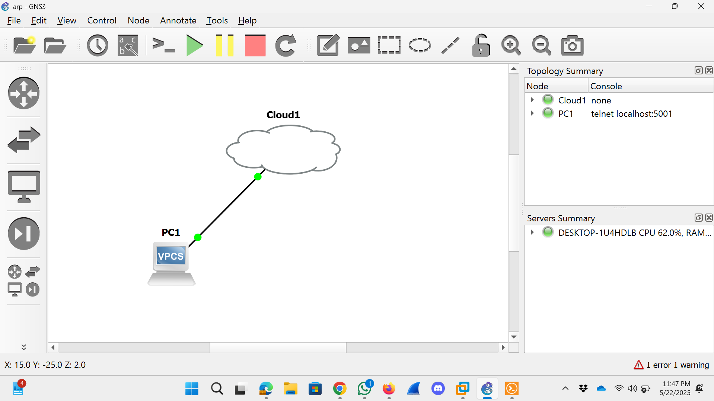

# 🛠️ GNS3 + Kali Lab Setup Notes

This document provides a step-by-step overview of how the ARP spoofing lab was created and run using GNS3 and Kali Linux.

---

## ⚙️ VM Configuration (Kali Linux)

- **Tool used:** VMware Workstation
- **Disk:** 20 GB
- **Network Adapter:** Custom → `VMnet1`
- **Desktop:** XFCE (default)
- **Tools Installed:** `dsniff` (includes `arpspoof`), `bettercap` (optional)
- **Final IP Address:** `192.168.15.130`

---

## 🧭 GNS3 Lab Setup

### Devices Used:
- **Cloud Node**: bridges GNS3 to Kali VM via `VMnet1`
- **VPCS Node**: acts as the victim (PC1)

### 📸 GNS3 Topology Diagram



---

## 🧱 Step-by-Step GNS3 Configuration

1. **Create New Project**  
   Open GNS3 → File → New Project → `ARP-Spoofing-Lab`

2. **Drag Devices into Workspace**
   - Cloud node (from Built-in > Cloud)
   - VPCS (from End Devices > VPCS)

3. **Configure Cloud Node**
   - Right-click Cloud → **Configure**
   - Go to **NIO Ethernet**
   - Select: `VMware Network Adapter VMnet1`
   - Click **Add → Apply → OK**

4. **Link Cloud to VPCS**
   - Use the cable tool
   - Connect Cloud’s Ethernet0 ↔ VPCS’s f0

5. **Configure VPCS IP**
   Open PC1 terminal:
   ```bash
   ip 192.168.15.100 255.255.255.0 192.168.15.1
